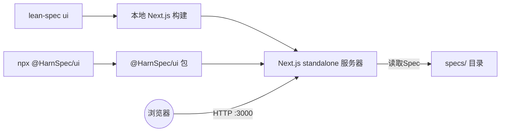
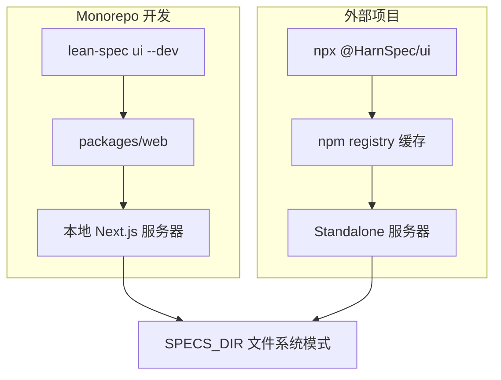

# 可视化模式

HarnSpec UI 提供了一个可视化的网页界面，用于浏览和管理Spec。它非常适合视觉学习者、团队演示和探索性Spec浏览。


## 什么是可视化模式？

可视化模式是一个本地网页应用程序，提供：

- **交互式Spec浏览器**：浏览具有丰富格式和语法高亮的Spec
- **依赖关系可视化**：以交互式图形查看Spec之间的关系
- **项目概览**：一目了然地查看项目统计数据和指标
- **搜索和筛选**：按状态、标签或内容快速查找Spec
- **看板视图**：按状态组织的看板式可视化

## 何时使用 UI 与 CLI

**使用 UI 的情况：**
- 可视化探索和发现Spec
- 向利益相关者或团队成员展示Spec
- 可视化依赖关系和关联
- 获取高层次的项目概览
- 浏览Spec而无需记住命令

**使用 CLI 的情况：**
- 快速创建或编辑Spec
- 使用脚本自动化工作流
- 与 CI/CD 管道集成
- 在仅终端环境中工作
- 执行批量操作

## 入门指南

### 方法 1：使用 `lean-spec ui`

如果您已安装 HarnSpec CLI：

```bash
lean-spec ui
```

此命令将：
- 自动检测您的Spec目录
- 在 3000 端口启动网页服务器
- 自动打开您的默认浏览器

### 方法 2：使用 `npx @HarnSpec/ui`

您可以在不安装 CLI 的情况下直接运行 UI：

```bash
npx @HarnSpec/ui
```

这对以下情况很有用：
- 项目未安装 CLI
- 快速一次性使用
- 与未安装 HarnSpec 的团队成员共享

### 选项

两种方法支持相同的选项：

```bash
# 自定义Spec目录
lean-spec ui --specs ./my-specs

# 自定义端口
lean-spec ui --port 3100

# 不自动打开浏览器
lean-spec ui --no-open

# 组合选项
lean-spec ui --specs ./docs/specs --port 3100 --no-open
```

**可用选项：**
- `-s, --specs <dir>` - 指定Spec目录（默认自动检测）
- `-p, --port <port>` - 服务器端口（默认：3000）
- `--no-open` - 不自动打开浏览器

## 功能特性

### Spec浏览器

主界面以列表视图显示所有Spec：

- **丰富格式**：带语法高亮的 Markdown 渲染
- **状态指示器**：Spec状态的可视化徽章（planned、active、done 等）
- **快速筛选**：按状态、标签或优先级筛选
- **搜索**：跨所有Spec的全文搜索


### Spec详情视图

点击任何Spec查看：

- **完整内容**：完整Spec以适当格式渲染
- **元数据**：清晰显示所有前置字段
- **相关Spec**：依赖关系和相关工作的链接
- **快速操作**：编辑、查看源代码或在文件系统中打开的链接


### 依赖关系图

可视化Spec之间的关联：

- **交互式图形**：拖动节点、缩放和平移
- **关系线**：查看哪些Spec依赖于其他Spec
- **点击导航**：点击任何节点查看该Spec
- **按状态筛选**：仅显示活动Spec、已完成工作等


### 看板视图

按状态组织Spec的看板式视图：

- **拖放**：在状态列之间移动Spec（如果启用）
- **状态列**：Planned、Active、Done 等
- **卡片预览**：一目了然地查看Spec标题、标签和负责人


### 项目统计

显示项目指标的仪表板：

- **总Spec数**：整体Spec计数
- **按状态**：每个状态中Spec的细分
- **按优先级**：优先级级别的分布
- **按标签**：最常用的标签


### 搜索视图

需要立即定位Spec？搜索框输入后实时刷新，列表和看板都会同步过滤。


## 架构总览



### Monorepo vs 外部项目



## 文件系统模式的工作原理

UI 使用 **文件系统模式**，这意味着它会自动与您的本地文件保持同步。


### 直接文件访问
- 无需数据库
- 直接从 `specs/` 目录读取
- 无需设置或配置

### 实时更新
- 60 秒缓存 TTL
- Spec文件的更改会自动显示
- 在编辑器中编辑Spec，在 UI 中查看更新

### 为什么采用这种架构？

**简单性**：无需配置、迁移或维护数据库

**可靠性**：您的Spec始终与文件系统同步

**可移植性**：在任何有 `specs/` 目录的项目中都可以工作

**性能**：缓存确保快速加载时间，同时保持更新

## 开发工作流

### 同时使用 UI 和 CLI

UI 和 CLI 相互补充：

```bash
# 终端 1：运行 UI
lean-spec ui

# 终端 2：处理Spec
lean-spec create new-feature
lean-spec update new-feature --status=active

# UI 会在 60 秒内自动反映更改
```

### 团队协作

**在本地网络上共享：**

```bash
# 查找您的 IP 地址
ifconfig | grep "inet " # 或在 Windows 上使用 ipconfig

# 启动 UI 并共享 URL
lean-spec ui --port 3000
# 共享：http://192.168.1.xxx:3000
```

**对于远程团队：**
- 考虑将 UI 部署到共享服务器
- 使用 ngrok 或类似工具进行临时共享
- 或共享截图/屏幕录制

### 演示和展示

UI 非常适合向利益相关者展示Spec：

1. **简洁界面**：专业、无干扰的视图
2. **依赖关系图**：可视化项目结构
3. **看板视图**：显示进度和状态
4. **交互式**：在讨论期间在相关Spec之间导航

## 故障排除

### 找不到Spec目录

**问题**：`Error: Could not find specs directory`

**解决方案**：
```bash
# 明确指定目录
lean-spec ui --specs ./path/to/specs

# 或确保您在项目根目录
cd /path/to/project
lean-spec ui
```

### 端口已被占用

**问题**：`Error: Port 3000 is already in use`

**解决方案**：
```bash
# 使用不同端口
lean-spec ui --port 3100

# 或停止使用 3000 端口的进程
# 在 macOS/Linux 上：
lsof -ti:3000 | xargs kill

# 在 Windows 上：
netstat -ano | findstr :3000
taskkill /PID <PID> /F
```

### UI 未在浏览器中打开

**问题**：服务器启动但浏览器未打开

**解决方案**：
```bash
# 手动打开：http://localhost:3000
# 或禁用自动打开并使用您喜欢的浏览器
lean-spec ui --no-open
```

### UI 版本过时

**问题**：功能缺失或 UI 看起来不同

**解决方案**：
```bash
# 清除 npm 缓存并重新安装
npx clear-npx-cache
npx @HarnSpec/ui@latest

# 或如果使用 CLI，更新它
npm install -g @HarnSpec/cli@latest
```

### 更改未显示

**问题**：编辑了Spec但 UI 仍显示旧内容

**解决方案**：
- 等待最多 60 秒以使缓存过期
- 硬刷新浏览器（Cmd+Shift+R / Ctrl+Shift+R）
- 检查文件是否正确保存

### 找不到构建（Monorepo 开发模式）

**问题**：`Error: Build directory not found`

**解决方案**：
这仅影响 monorepo 中的 HarnSpec 贡献者：
```bash
cd packages/web
npm run build
```

## 技巧与最佳实践

### 性能

- UI 缓存Spec 60 秒 - 大型项目快速加载
- 使用搜索和筛选缩小查看范围
- 如果 UI 感觉慢，关闭其他浏览器标签页

### 工作流集成

- 在工作时在浏览器标签页中保持 UI 运行
- 将其用作代码编辑器旁边的"Spec仪表板"
- 在开始实施之前在 UI 中审查Spec

### 团队采用

- 在团队会议中演示 UI 以提高采用率
- 在Spec审查期间共享 URL
- 在冲刺计划会议中使用看板视图

## 下一步

- **了解更多**：查看 [CLI 参考](/docs/reference/cli#lean-spec-ui) 以获取所有命令选项
- **UI 包**：查看 [@HarnSpec/ui](/docs/reference/ui-package) 以获取技术细节
- **入门**：阅读[入门指南](/docs/guide/getting-started)以设置您的第一个Spec

## 相关文档

- [CLI 参考 - `lean-spec ui` 命令](/docs/reference/cli#lean-spec-ui)
- [UI 包参考](/docs/reference/ui-package)
- [入门指南](/docs/guide/getting-started)
- [管理Spec](/docs/guide/usage/cli/creating-managing)
